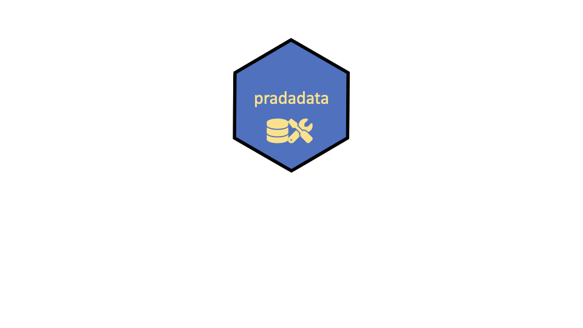

<!-- README.md is generated from README.Rmd. Please edit that file and NOT the md file. -->

```{r, echo = FALSE}
knitr::opts_chunk$set(
  collapse = TRUE,
  comment = "#>",
  fig.path = "man/figures/"
)
```

# pradadata 


 <!-- badges: start -->
 
[](https://travis-ci.org/sebastiansauer/pradadata)

<!-- badges: end -->


Data sets for practical data analysis


## Contents

Data sets featuring data from

- `precip_temp_DWD`: temperature and precipitation in Germany, [csv](https://raw.githubusercontent.com/sebastiansauer/pradadata/master/data-raw/precip_temp_DWD.csv)
- `ames_de_train`: Ames housing train set, shortened version, [csv](https://raw.githubusercontent.com/sebastiansauer/pradadata/master/data-raw/ames_de_train.csv)
- `ames_de_test`: Ames housind test set, shortened version, [csv](https://raw.githubusercontent.com/sebastiansauer/pradadata/master/data-raw/ames_de_test.csv)
- `elec_results`: German elections 2017, [csv](https://raw.githubusercontent.com/sebastiansauer/pradadata/master/data-raw/elec_results.csv)
- `wellbeing`: OECD wellbeing 2016, [csv](https://raw.githubusercontent.com/sebastiansauer/pradadata/master/data-raw/wellbeing.csv)
- `extra`: survey on extraversion 2015-2016, [csv](https://raw.githubusercontent.com/sebastiansauer/pradadata/master/data-raw/extra.csv)
- `cult_values`: Schwartz cultural values 1988-2000, [csv](https://raw.githubusercontent.com/sebastiansauer/pradadata/master/data-raw/cult_values.csv)
- `socec`: sociol economic data of all German 2017 electoral districts, [csv](https://raw.githubusercontent.com/sebastiansauer/pradadata/master/data-raw/socec.csv)
- `wahlkreise_shp`: geomap of German electoral districts 2017, [shape-file]()
- `wo_men`: toy data set on sex, height, and shoe size, and their differences between women and men, [csv](https://raw.githubusercontent.com/sebastiansauer/pradadata/master/data-raw/wo_men.csv)
- `dating`: online dating platform experiment 2015, [csv](https://raw.githubusercontent.com/sebastiansauer/pradadata/master/data-raw/dating.csv)
- `germanlex`: German sentiment lexicon, [csv](https://raw.githubusercontent.com/sebastiansauer/pradadata/master/data-raw/germanlex.csv) 
- `sentiws`: German sentiment lexicon, [csv](https://raw.githubusercontent.com/sebastiansauer/pradadata/master/data-raw/sentiws.csv)
- `stats_test`: predictors and score of statistics test, [csv](https://github.com/sebastiansauer/pradadata/blob/master/data-raw/stats_test.csv)
- `countries`: names of world countries, [csv](https://raw.githubusercontent.com/sebastiansauer/pradadata/master/data-raw/countries.csv)
- `afd`: party platform of the AfD party as of 2016 ("Alternative fuer Deutschland"), [csv](https://raw.githubusercontent.com/sebastiansauer/pradadata/master/data-raw/afd.csv)
- `afd_2022`: party platform of the AfD party as of 2022 ("Alternative fuer Deutschland"), [csv](https://raw.githubusercontent.com/sebastiansauer/pradadata/master/data-raw/afd_2022.csv)
- `schimpfwoerter`:  List of profane words (Schimpfwörter) in German [csv](https://raw.githubusercontent.com/sebastiansauer/pradadata/master/data-raw/schimpfwoerter.csv)
- `offensive`:  List of potentially offensive short texts in German [csv](https://raw.githubusercontent.com/sebastiansauer/pradadata/master/data-raw/offensive.csv)
- `wild_emojis`: Several emojis frequently used to express discontent or hate [csv](https://raw.githubusercontent.com/sebastiansauer/pradadata/master/data-raw/wild_emojis.csv)
- `corr_data`: Simulated correlation data
[csv](https://raw.githubusercontent.com/sebastiansauer/pradadata/master/data-raw/corr_data.csv)


Notes that some (most) of these data sets were *not* published by the author of this package. The original authors and the respective licences can be found in the desription of each data set.


## Installation

`devtools::install_github("sebastiansauer/pradadata")`

The package `devtools` need to be installed.

## Getting started

In R (or RStudio) type (after having installed the package)
`library("pradadata")`


## Access the data without package

Use the following template to access the datasets as csv files:

`https://raw.githubusercontent.com/sebastiansauer/pradadata/master/data-raw/<NAME-OF-DATASET>.csv`.


## Get help
`help("pradadata")`


## Requirements
R


## Licence

[](http://www.gnu.org/licenses/gpl-3.0.html)


## DOI

[](https://zenodo.org/badge/latestdoi/109450408)


